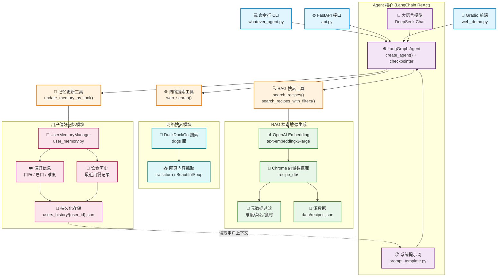

# Agent 架构图



## 数据流说明

### 1. RAG 搜索流程
```
用户查询 → 语义搜索 → Embedding 向量化 → Chroma 相似度检索
  → 元数据过滤（难度/菜名/食材） → 返回匹配菜谱
```

### 2. 网络搜索流程
```
用户查询 → DuckDuckGo 搜索 → 网页内容提取（trafilatura/BS4）
  → 清洗格式化 → 返回搜索摘要
```

### 3. 用户偏好记忆流程
```
对话中提取偏好 → update_memory_as_tool() 工具调用
  → UserMemoryManager 更新内存 → 写入 users_history/*.json
  → 刷新系统提示词 → 后续对话感知用户偏好
```
